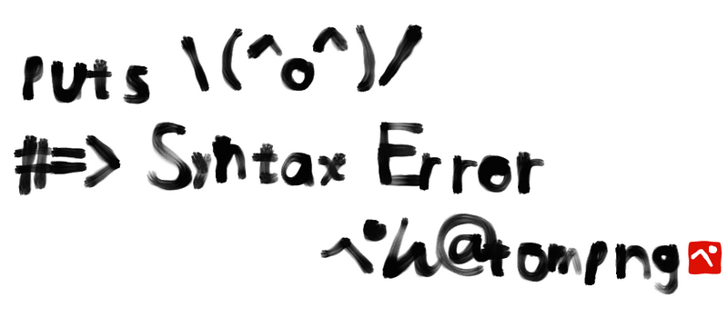

手書きぺんの筆跡
====
Demo
----
  https://tompng.github.io/myfont/
Sample
----
```
puts \(^o^)/
#=> Syntax Error
         ぺん@tompng
```
[](https://tompng.github.io/myfont/#mode=brush&text=puts%20%5C(%5Eo%5E)%2F%0A%23%3D%3E%20Syntax%20Error%0A%20%20%20%20%20%20%20%20%20%E3%81%BA%E3%82%93%40tompng)
